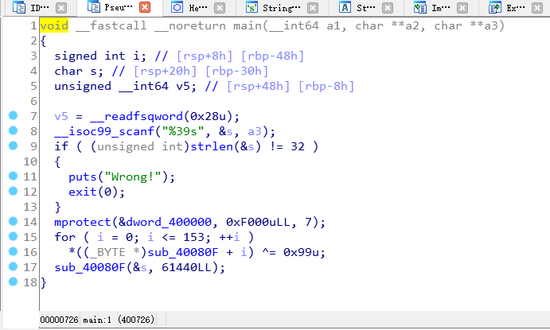
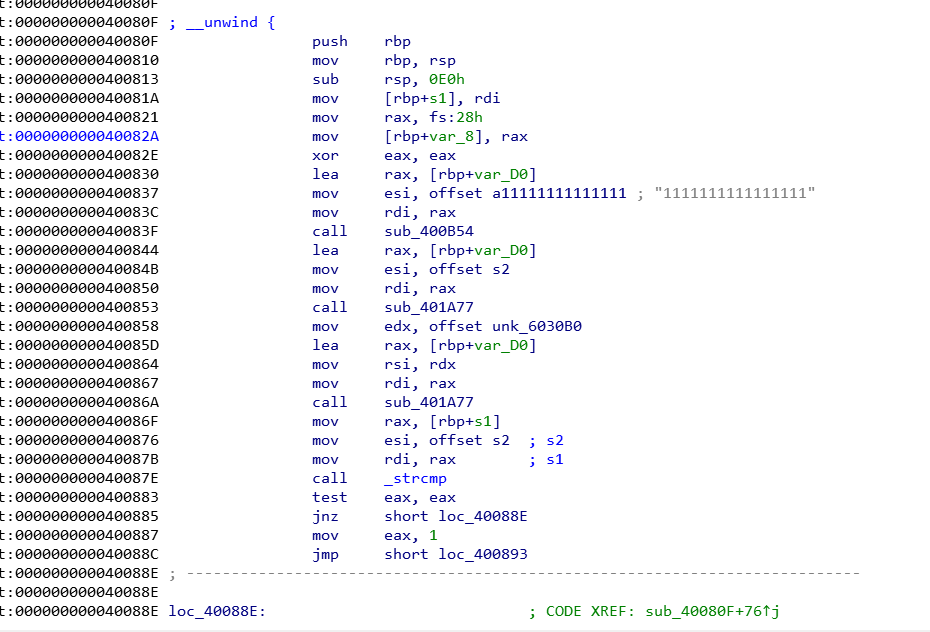
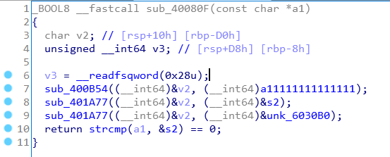

# NEXCTF2019
## Preface

This is the first time that our students of grade 17 hold CTF.  The design of challenges fully considers the progressive step and takes care of the freshmen of grade 19. Finally, I hope you can get something from NEXCTF2019, and I hope this can arouse your interest in learning CTF. We NEX is a CTF team in Northeastern University. Forget to say, the ranking in CTF is not important. We sincerely hope that you can improve yourself through one competition after another. As a team of ideological exchange, we sincerely welcome you to come at any time.

## The author's complaint

Before the ninth week,  the week of exam. As a pwn and reverse player in the NEX team, I have the unavoidable responsibility to give this writeup. So, I worked hard to write the writeup of binary(Pwn, Reverse) challenges.

## Reverse

There are three reverse challenges in this CTF. Actually, the number of people who solve reverse challenges is far below my expectation. What a disappointment it is. Below is writeup of challeng "Re3".

Using IDA to open this program, we easily found that this program is very simple:



First receive a string of length 39. Then, for the function `sub_40080F`, performing xor with value `0x99`. This technology is called SMC (Self Modify Code), which changes its code at runtime.

When cracker open the function `sub_40080F`, he'll quickly find that this function is con't readable.

At this point, there are two solutions:

- Debug this ELF executable, and make a break point, analyze the function in memory.
- Use IDAPython to decrypt manually.

First solution, you should configure IDA remote debugging environment, that's easily, any question, baidu or goolge it.

Second solution, It's convenient for you to get starting with IDAPython, docs: https://www.hex-rays.com/products/ida/support/idapython_docs/. Note that idatython failed to run, It may be the wrong configuration of the python environment of your computer.

```python
start = 0x40080F
end = 0x04008A8
ads = start
while ads <= end:
	t = get_byte(ads)
	patch_byte(t^0x99)
	ads += 1
print "OK"
```

After runing this IDAPython, you'll find function sub_400B0F shows below, note that pressing 'U' to undefine, and pressing 'P' to define procdure (function). If you didn't do this, you may not succeed






Here I recommend you use the findcrypt plug-in of ida, will soon find this is AES algorithm.

```c
AES_init_ctx(&ctx, key);
AES_ECB_decrypt(&ctx, vdata);
AES_ECB_decrypt(&ctx, vdata+0x10);
```

So the problem was solved immediately.

```python
In [8]: from Crypto.Cipher import AES

In [9]: key = b"1111111111111111"

In [10]: cipher = b"\xE7\x5B\x8A\xCA\x42\x27\x46\x41\xE8\x0A\xD9\x5A\x9A\x7F\x2E\x11\x53\xBB\xCB\xDA\xE9\x98\xA0\xC3\xA2\x14\x2E\x3B\x26\x5E\x33\x97"

In [11]: aes = AES.new(key, AES.MODE_ECB)

In [12]: m = aes.decrypt(cipher)

In [13]: print m
flag{i_th1nk_reverse_1n_CTFisok}

```


